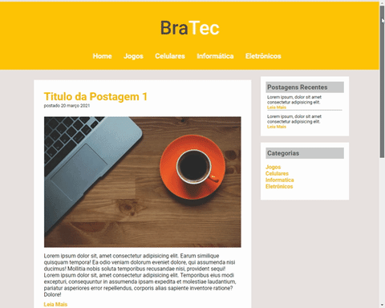

<h1 align="center">Sites e Outros</h1>

  
 
  

---

  <a href="https://github.com/Guilherme-G-Cadilhe">• 🗺 Perfil</a> |
   <a href="https://github.com/Guilherme-G-Cadilhe/Projetos">• 🛠️ Projetos</a> 

---
<h2 align="center">
 Projetos, Testes e Exercícios de Front-End, com HTML, CSS , JavaScript, etc.
  </h2>

   
 <b>Projetos Completos </b>

  
 <b>3 - </b>  <i>(Clique Aqui para Expandir!)</i> 

   
  
  ### 1- 🏷️ Voice Memo App Template

 

> <a href="https://www.evernote.com/l/As9KrvidzfFP34KVGms07I0cbU7m9KW0vaw/"> 🧱 Fotos/Gifs e Detalhes/Código</a>  
- **Descrição:** *Projeto de Voice Memo App Template, desenvolvido durante a aula do **Erick Wendel** no Youtube. 
Utilizando HTML5, Media Recorder e getUserMedia Web APIs, e usando modularização nativa com EcmaScript Modules*
 

  
  ### 2- 🏷️ GrandChase Landing Page

 

> <a href="https://github.com/Guilherme-G-Cadilhe/GrandChase_LandingPage"> 🚀 Link do Projeto no Repositório</a>  
- **Descrição:** *Projeto de Landing Page de Personagem, desenvolvido e inspirado no Projeto **FrontWeek de Násser Yousef Ali**. 
Utilizando como base e inspiração, **Grand Chase** em vez de **Spiderman** como no projeto Original.*
 

  ### 3- 🏷️ Dev.Finances

> <a href="https://github.com/Guilherme-G-Cadilhe/DevFinances"> 🚀 Link do Projeto no Repositório</a>  
- **Descrição:** *Junção de Dois projetos diferentes para criar um projeto único com um "universo" proprio. 
Um **Página de Finanças** para adicionar e Remover transações, com Calculo Automatico e outras funções. 
Uma **Landing Page** para apresentação do "Banco Dev.Finances", ambos com as páginas responsivas e dinamicas.*

---
 <b> Projetos de Exercicios e Testes </b>

  
 <b>12 - </b><i>(Clique Aqui para Expandir!)</i> 

   

### 12- 🏷️ Timer

 

> <a href="https://www.evernote.com/l/As_avggzOVRCU74NOTTGgmEmXtkjM3NQWTU/"> 🧱 Fotos/Gifs e Detalhes/Código</a>  
- **Descrição:** *Uitliza new Date(), event.target e Interval para criar um Timer com Pausar, Voltar, e Zerar*
- **Ferramenta:** *JavaScript, CSS, HTML.*
  

 

### 11- 🏷️ Calculadora IMC

 

> <a href="https://www.evernote.com/l/As_avggzOVRCU74NOTTGgmEmXtkjM3NQWTU/"> 🧱 Fotos/Gifs e Detalhes/Código</a>  
- **Descrição:** *Contém testes de validação, funções de escopo separados, e os casos são armazenados em Array*
- **Ferramenta:** *JavaScript, CSS, HTML.*
  

 

### 10- 🏷️ Analisador de Número

 

> <a href="https://www.evernote.com/l/As_U4IUb9VZKV6vQmdRx2-CG2FtoJFoFcsQ/"> 🧱 Fotos/Gifs e detalhes</a>  
- **Descrição:** *Adiciona números para um Array, e depois calcula algumas funções e mostra o resultado.*
- **Ferramenta:** *JavaScript, CSS, HTML.*
  

 

### 9- 🏷️ Tabuada

 

> <a href="https://www.evernote.com/l/As9l4-cp2KFO7ot94BEbUYmJFbQF57ShNrk/"> 🧱 Fotos/Gifs e detalhes</a>  
- **Descrição:** *Faz a tabuada até 10 do número inserido*
- **Ferramenta:** *JavaScript, CSS, HTML.*
  

 

### 8- 🏷️ Contador

 

> <a href="https://www.evernote.com/l/As-Gnwz50xtLkr1djlaGJ1m0oY8cJgsLEy0/"> 🧱 Fotos/Gifs e detalhes</a>  
- **Descrição:** *Utilizando Javascript para fazer contagens de um número a outro, podendo mudar o passo, funciona com negativos e crescente/decrescente*
- **Ferramenta:** *JavaScript, CSS, HTML.*
  

 

### 7- 🏷️ Horario do Dia

 

> <a href="https://www.evernote.com/l/As9JunljBTVJ04q_wZtyG_5trYzymbMWheM/"> 🧱 Fotos/Gifs e detalhes</a>  
- **Descrição:** *Utilizando Javascript para mostrar o seu horario atual, e uma imagem de fundo condizente com o horario*
- **Ferramenta:** *JavaScript, CSS, HTML.*
  

 

### 6- 🏷️ Verificador de Idade

 

> <a href="https://www.evernote.com/l/As8ibw-XboBHLaYYWyhVBKSob7SRr5Omw8E/"> 🧱 Fotos/Gifs e detalhes</a>  
- **Descrição:** *Utilizando Javascript para mostrar uma foto que se encaixe no padrão da sua faixa etaria, baseado na idade calculada*
- **Ferramenta:** *JavaScript, CSS, HTML.*
  

 

### 5- 🏷️ Hotel Paraíso

 

> <a href="https://www.evernote.com/l/As9udb353AxBvYQEnkRMkaN-yZvN85h8EGc/"> 🧱 Fotos/Gifs e detalhes</a>  
- **Descrição:** *Criando um Site Responsivo e Dinâmico com Flexbox, para praticar, entender e aprender seus usos.*
- **Ferramenta:** *CSS, HTML.*
  

 

### 4- 🏷️ Sasha Products

> <a href="https://www.evernote.com/l/As8iGhW0jtdGW5e7cmfRL7oiqouWZuStQYE/"> 🧱 Fotos/Gifs e detalhes</a>  
- **Descrição:** *Criando um Site Responsivo e Dinâmico com Flexbox, para praticar, entender e aprender seus usos.*
- **Ferramenta:** *CSS, HTML.*

 

### 3- 🏷️ Página Inicial Instagram

> <a href="https://www.evernote.com/l/As-x8L7cbnBJPr4MRlTVlzvmrGKt_f28lS8/"> 🧱 Fotos/Gifs e detalhes</a>  
- **Descrição:** *Criando um Site Responsivo e Dinâmico com Flexbox, para praticar, entender e aprender seus usos.*
- **Ferramenta:** *CSS, HTML.*
  

 

### 2- 🏷️ BraTec

 

> <a href="https://www.evernote.com/l/As9V7F9dwZtIkJV72okWrFwyO5oZI2AOVAg/"> 🧱 Fotos/Gifs e detalhes</a>  
- **Descrição:** *Refazendo um dos meus primeiros exercicios de site.*
- **Ferramenta:** *CSS, HTML.*
  

 

### 1- 🏷️ Anna Belle

> <a href="https://www.evernote.com/l/As9ORwINPwxIn4trCeuMJUUIOEKmcglauss/"> 🧱 Fotos/Gifs e detalhes</a>  
- **Descrição:** *Refazendo um dos meus primeiros exercicios de sites, utilizando flexbox. Contém 4 páginas.*
- **Ferramenta:** *CSS, HTML.*
  
  

---

